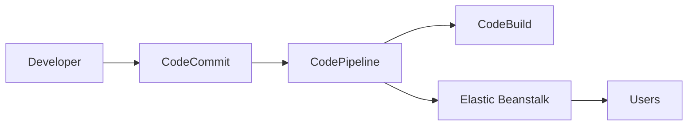
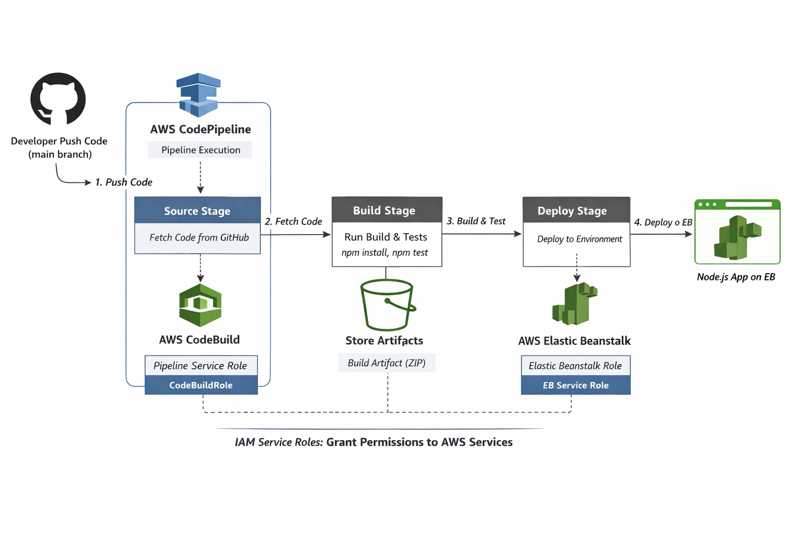

# AWS Node.js CI/CD Pipeline

Testing for pipeline.

## Overview
This project demonstrates an **end-to-end CI/CD pipeline** for a Node.js web application using:

- **AWS CodeCommit** (Source Control)
- **AWS CodeBuild** (Build Automation)
- **AWS CodePipeline** (Orchestration / Deployment)
- **Elastic Beanstalk** (Hosting / Live Environment)

The pipeline automatically builds, tests, and deploys the Node.js application on every code commit, ensuring **continuous delivery**.

---

## Architecture Diagram

### Mermaid Diagram (Live)

