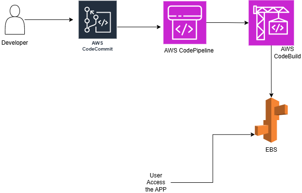

# AWS Node.js CI/CD Pipeline

## Overview
This project demonstrates an end-to-end CI/CD pipeline for a Node.js web application using:

- AWS CodeCommit (Source Control)
- AWS CodeBuild (Build Automation)
- AWS CodePipeline (Pipeline / Deployment)
- Elastic Beanstalk (Hosting)

## Architecture Diagram
```mermaid
graph LR
    A[Developer] --> B[CodeCommit]
    B --> C[CodePipeline]
    C --> D[CodeBuild]
    C --> E[Elastic Beanstalk]
    E --> F[Users]

